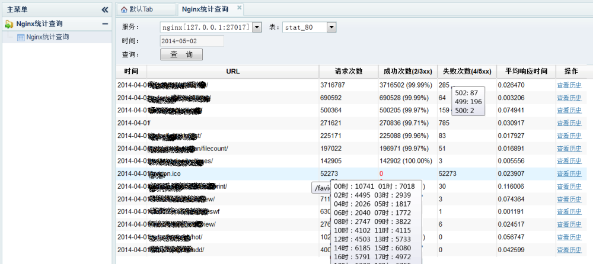

mongo-c-driver-0.98.0#nginx 统计模块。#  
  ngx_req_stat是一个nginx状态统计模块，其统计项是可配置的，并且可以统计不同的虚拟主机，不同的URL。可以统计的包括请求次数，各个状态码的次数，不同的时间段的次数。输出的流量累计信息，平均处理时间等等。

统计信息最终存储在mongodb中。使用mongodb进行统计信息存储，是因为mongodb支持下面的操作语句：
```bash
	db.stat_table.update({'date':'2014-04-04', 'url':'/test01'}, {'$inc':{'count':1,'req_time.all':0.005,'status.200': 1}}, true)
	#这种语句反复执行，数据库会生成相应的累加记录，大概是这样的(略掉了ID字段)：
	{"count" : 1, "date" : "2014-04-04", "req_time" : { "all" : 0.005 }, "status" : { "200" : 1 }, "url" : "/test01" }
```
在上面的语句中包含几个主要信息：
`stat_table` 是表名，
`{'date':'2014-04-04', 'url':'/test01'}` 是更新主键，后面可以以主键来进行查询。
`{'$inc':{'count':1,'req_time.all':0.005,'status.200': 1}}` 是更新表达式，必须是一个json格式的符合mongodb语句的。

##安装项目依赖项##
* 网址
```
mongo-c-driver  https://github.com/mongodb/mongo-c-driver<br/> 
json-c http://www.linuxfromscratch.org/blfs/view/svn/general/json-c.html
由于mongo-c-driver及json-c不同版本会有不兼容的问题出现，ngx_req_stat/libs下面有已经测试可以编译通过的版本。
```

* mongo-c-driver安装：
```	
cd path/to/ngx_req_stat/libs
tar -xvf mongo-c-driver-0.98.0.tar.gz
cd mongo-c-driver-0.98.0
./configure --prefix=/usr
make && make install
```
* json-c 安装:
```
cd path/to/ngx_req_stat/libs
tar -xvf json-c.tar.gz
./configure --prefix=/usr
make && make install
```
* 安装mongodb:
```
统计模块的统计信息存储在mongodb中，所以需要先安装mongodb。
到http://www.mongodb.org/downloads页面下载合适的版本。
```
###比如下载32位linux版本的安装过程:	
cd /usr/local
wget http://fastdl.mongodb.org/linux/mongodb-linux-i686-2.x.x.tgz
####\#解压：把程序解压到/usr/local目录下。
`tar -xvf mongodb-linux-i686-2.0.9.tgz`
####\#建立软连接
`ln -s mongodb-linux-i686-2.0.9 mongodb`
####\#创建配置目录
`mkdir /usr/local/mongodb/conf/`
#####\#创建配置文件：`/usr/local/mongodb/conf/mongodb.conf`, 内容如下：
```
fork = true
bind_ip = 127.0.0.1
port = 27017
quiet = true
dbpath = /data/mongodb-ngx-stat/
pidfilepath = /data/mongodb-ngx-stat/mongodb.pid
logpath = /data/mongodb-ngx-stat/logs/mongod.log
journal = true
journalCommitInterval=300
syncdelay=300
```
#创建数据存储目录
`mkdir -p /data/mongodb-ngx-stat/logs`
#启动数据库
`/usr/local/mongodb/bin/mongod -f` `/usr/local/mongodb/conf/mongodb.conf`
#测试,连接默认地址及端口。
`/usr/local/mongodb/bin/mongo`
出现如下信息，表示连接成功了：
```
MongoDB shell version: 2.0.9
connecting to: test
>> 
```
	
#本模块编译#
```
本模块中使用了C++的STL,所以需要给nginx添加C++支持(修改make文件)。
C++支持的补丁在：https://github.com/jie123108/ngx_cpp_make_patch 请自行下载。
打补丁使用：
cd nginx-1.x.x
patch -p1 < /path/to/nginx-cpp_make.patch
编译本模块：
cd nginx-1.x.x
./configure --add-module=/path/to/ngx_req_stat
make
make install
```

#标准配置示例#
```
nginx.conf 
server {
    # 默认的主键，不用定义，名称为def，推荐的主键为：$date+$uri 这样可以按天及URL对统计进行查看。
    #stat_key def "{'date':'$date','url':'$uri'}";
    # 可以使用stat_key定义其它格式的主键，并取不同的名称，然后在其它req_stat指令(第二个参数)中使用。
    
    # mongodb配置(下面是默认配置值)。
    mongo_uri mongodb:://127.0.0.1:27017/
    
    #统计配置，主键使用默认定义的def。该配置的含义是：
    req_stat stat_tbl def "{'%inc': {'count':1,'hour_cnt.$hour':1, 'status.$status':1,'req_time.all': $request_time, 'req_time.$hour': $request_time}}";
    # %inc 是mongodb的$inc指令，表示为后面的每一项值进行加操作，由于nginx.conf不$会被解析成变量，所以使用%替代。
    # 'count':1 对count字段加一
    # 'hour_cnt.$hour':1 按小时，对当前小时的统计项加一
    # 'status.$status:1' 对处理结果状态吗加一
    # 'req_time.all' 所有请求时间累加
    # 'req_time.$hour' 每个小时的请求时间累加
    # req_stat 指令可以出现在http,server,location上下文中，并且不同的地方可以配置不同的主键及统计值。
    
    # 如果要关闭某个location的统计，使用:
    #req_stat off;
    # 定义刷新记录到mongodb中的时间。单位是毫秒，可以带上h,m,s等单位表示时，分,秒。默认为5秒。该值设置的越大，mongodb的负载会越低。因为模块在内存中会对相同的统计项进行合并，然后插入。
    mongo_flush_interval 5s; 
}
```
## 主键选择说明：
>一般情况是使用 $date, $uri 就可以了，有时也可以加上其它参数，比如下面的示例中：
按根据请求头里面的x_province参数进行区分统计:
```
stat_key province '{"date":"$date","url":"PRO:$http_x_province"}';
req_stat province_stat province "{'%inc': {'count':1,'hour_cnt.$hour':1, 'status.$status':1,'req_time.all': $request_time, 'req_time.$hour': $request_time}}";
```
根据请求参数中的from参数进行统计：
```
stat_key from '{"date":"$date","url":"ISP:$arg_from"}';
req_stat from_stat from "{'%inc': {'count':1,'hour_cnt.$hour':1, 'status.$status':1,'req_time.all': $request_time, 'req_time.$hour': $request_time}}";
```
##### 另外，主键中不要包含变化的(随机化)的值。比如一个每次请求都会变化的URL，就不适合当主键，这种情况会导致每次请求都产生一条记录，统计数据库会膨胀很快。

##★★注意：req_stat为了统计模块插入更新效率更高，请一定对相关表创建索引，创建方法如下：<br/>
>
```bash
/usr/local/mongodb/bin/mongo`
#进入mongo数据库，打开统计数据库ngx_stat
use ngx_stat;
#创建索引。其中 stat_tbl为req_stat语句中指定的统计表名（第一个参数）。
#创建的联合索引date，url 分别为def主键对应的两个字段。如果你使用的主键名称是其它字段，请修改索引字段。
db.stat_tbl.ensureIndex({date:1,url:1},{unique:true,dropDups:true})
```

##最小配置示例：

```bash
server {
    #其它配置都使用默认值。
    req_stat stat_tbl def "{'%inc': {'count':1,'hour_cnt.$hour':1, 'status.$status':1,'req_time.all': $request_time, 'req_time.$hour': $request_time}}";
}
```

##测试配置使用说明：

```
项目代码conf/nginx.conf测试配置中，为了测试方便，使用了echo-nginx-module模块。如果你要运行该测试，请自行下载echo-nginx-module模块，再编译：
```
	./configure --add-module=/path/to/ngx_req_stat --add-module=/path/to/echo-nginx-module
	nake & make install

####启动nginx后，可以使用下面的脚本简单测试下：
```bash
for ((i=0;i<20;i++));do
curl http://127.0.0.1:80/login/404 > /dev/null 2>&1
curl http://127.0.0.1:80/login?username=jie123108\&pwd=123
curl http://127.0.0.1:80/loginbyemail?email=jie123108@163.com\&pwd=123
done

for ((i=0;i<20;i++));do
curl http://127.0.0.1:80/login_new?client_type=pc\&username=jie123108\&pwd=123
curl http://127.0.0.1:80/login_new?client_type=android\&username=jie123108\&pwd=123
curl http://127.0.0.1:80/login_new?client_type=ios\&username=jie123108\&pwd=123
done

for ((i=0;i<20;i++));do
curl http://127.0.0.1:81/login/404 > /dev/null 2>&1
curl http://127.0.0.1:81/login?username=jie123108\&pwd=123
curl http://127.0.0.1:81/loginbyemail?email=jie123108@163.com\&pwd=123
curl http://127.0.0.1:81/nolog?xxxxx=xx
done
```
&nbsp;&nbsp;&nbsp;&nbsp;注意：在实际使用时，要先对表建索引，示例中使用了两个表(stat_80,stat_81)。创建索引过程如下：
```
/usr/local/mongodb/bin/mongo ngx_stat
MongoDB shell version: 2.0.9
connecting to: ngx_stat
> db.stat_80.ensureIndex({date:1,url:1},{unique:true,dropDups:true});
> db.stat_81.ensureIndex({date:1,url:1},{unique:true,dropDups:true});
```
####测试之后，数据库大概会生成类似下面的记录(_id字段隐藏了)：
```bash
> db.stat_80.find();
{ "count" : 20, "date" : "2014-04-06", "hour_cnt" : { "17" : 20 }, "req_time" : { "all" : 0, "17" : 0 }, "status" : { "200" : 20 }, "url" : "/login" }
{ "count" : 20, "date" : "2014-04-06", "hour_cnt" : { "17" : 20 }, "req_time" : { "all" : 0, "17" : 0 }, "status" : { "404" : 20 }, "url" : "/login/404" }
{ "count" : 20, "date" : "2014-04-06", "hour_cnt" : { "17" : 20 }, "req_time" : { "all" : 0, "17" : 0 }, "status" : { "200" : 20 }, "url" : "/loginbyemail" }
> db.stat_81.find();
{ "count" : 20, "date" : "2014-04-06", "hour_cnt" : { "17" : 20 }, "req_time" : { "all" : 0, "17" : 0 }, "status" : { "200" : 20 }, "url" : "/login" }
{ "count" : 20, "date" : "2014-04-06", "hour_cnt" : { "17" : 20 }, "req_time" : { "all" : 0, "17" : 0 }, "status" : { "404" : 20 }, "url" : "/login/404" }
{ "count" : 20, "date" : "2014-04-06", "hour_cnt" : { "17" : 20 }, "req_time" : { "all" : 0, "17" : 0 }, "status" : { "200" : 20 }, "url" : "/loginbyemail" }
```

##关于查询界面：
>
ngx_req_stat/NgxStatMgr 下面是一个简单的查询界面。使用Python编写。
#### 使用前请先安装依赖的库：
```bash
easy_install flask
easy_install simplejson
easy_install pymongo
```
#### 运行：
```sh
cd path/to/NgxStatMgr
export PYTHONPATH=`pwd`
python py/Main.py
```
#### 访问:
```
http://ip:83/ngxstatmgr
```
查询界面如下图：


联系作者:
=====
jie123108@163.com

